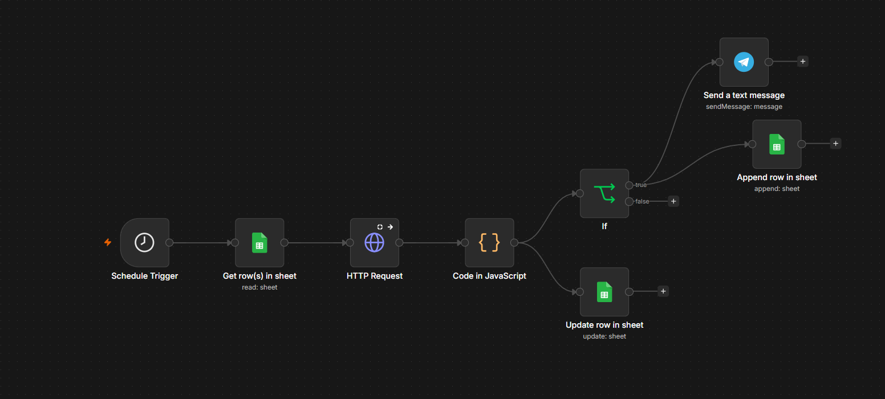

<div dir="rtl">

<h1 align="center">🛡️ مانیتورینگ خودکار سلامت و قطعی وب‌سایت‌ها </h1>

<p align="center">
  📡 یک سیستم هوشمند برای پایش دوره‌ای دسترس‌پذیری وب‌سایت‌ها که با مکانیزم <b>ضد هشدار کاذب</b>، تنها در صورت تأیید قطعی واقعی، به تیم فنی هشدار داده و پس از بازیابی، اطلاع‌رسانی می‌کند.
</p>

<p align="center">
  <b>✅ پایش خودکار چندین سایت • ✅ جلوگیری از هشدارهای اشتباه • ✅ اعلام بازیابی • ✅ ذخیرهٔ لاگ در گوگل شیت</b>
</p>

---

## 🎬 دموی کامل فرآیند (از تشخیص قطعی تا بازیابی و هشدار)

<p align="center">
  <a href="https://github.com/user-attachments/assets/d9065d41-ef4e-456c-8af1-7f904c808ec4">
  </a>
</p>

<p align="center">
  <video src="https://github.com/user-attachments/assets/d9065d41-ef4e-456c-8af1-7f904c808ec4" controls width="800">
    مرورگر شما از پخش ویدیو پشتیبانی نمی‌کند.
  </video>
</p>

> 🔄 در این ویدیو مشاهده می‌کنید که چگونه سیستم پس از شناسایی اولین قطعی، هشدار نمی‌دهد؛ اما پس از تأیید مجدد در بررسی بعدی، هشدار قطعی ارسال شده و در نهایت با آنلاین شدن سایت، پیام بازیابی به تیم فنی اعلام می‌شود.

---

## 🧩 معماری ورکفلو (ساختار گره‌ها در n8n)


<p align="center">
  
</p>

> 📌 این تصویر، زنجیرهٔ کامل این سیستم را نشان می‌دهد: از دریافت لیست سایت‌ها از گوگل شیت، بررسی هر سایت با HTTP Request، پردازش داده‌ها با JavaScript، ذخیره‌سازی وضعیت جدید و در نهایت تصمیم‌گیری برای ارسال هشدار یا پیام بازیابی.

---

## 🎯 این پروژه دقیقاً چه مشکلی را حل می‌کند؟

آژانس‌های طراحی سایت معمولاً ده‌ها وب‌سایت را برای مشتریان مختلف مدیریت می‌کنند. قطعی هر یک از این سایت‌ها می‌تواند به معنای از دست رفتن فروش، کاهش اعتبار و نارضایتی مشتری باشد. اما مشکل بزرگ‌تر، **هشدارهای کاذب** ناشی از نوسانات لحظه‌ای شبکه یا تاخیر موقتی سرور است که تیم فنی را خسته کرده و باعث بی‌اعتمادی به سیستم‌های هشدار می‌شود.

**این پروژه با یک مکانیزم هوشمند، دقیقاً این دو چالش را حل کرده است:**

۱. **📡 دریافت لیست سایت‌ها:** سیستم هر بار با خواندن از گوگل شیت، لیست وب‌سایت‌های تحت پایش را دریافت می‌کند.
۲. **🔍 بررسی دوره‌ای هر سایت:** با استفاده از HTTP Request، وضعیت دسترس‌پذیری هر سایت (کد وضعیت HTTP و زمان پاسخ‌دهی) در بازه‌های زمانی مشخص (مثلاً هر ۵ دقیقه) بررسی می‌شود.
۳. **🧠 پردازش هوشمند و مکانیزم ضد هشدار کاذب (Anti-Flapping):** گره JavaScript دقیقاً منطق زیر را پیاده‌سازی کرده است:
   - اگر سایت برای اولین بار DOWN شود، فقط `Fail_Count` افزایش می‌یابد و **هیچ هشداری ارسال نمی‌شود**.
   - اگر در بررسی بعدی (دومین بار متوالی) همچنان DOWN بود، `Fail_Count` به ۲ می‌رسد و **هشدار قطعی** ارسال می‌شود.
   - اگر سایت UP شود و قبلاً هشدار قطعی ارسال شده بود (`Fail_Count >= 2`)، پیام **بازیابی (Recovery)** ارسال شده و `Fail_Count` به صفر بازنشانی می‌شود.
   - اگر سایت UP شود اما قبلاً هشدار قطعی ارسال نشده بود، فقط وضعیت به‌روز می‌شود و پیامی ارسال نمی‌شود.
۴. **📊 بروزرسانی وضعیت در گوگل شیت:** آخرین وضعیت (UP/DOWN)، زمان پاسخ‌دهی، زمان بررسی و شمارنده خطا در جدول اصلی به‌روزرسانی می‌شود.
۵. **📝 ثبت لاگ رویدادها:** هر رویداد مهم (هشدار قطعی یا بازیابی) به‌همراه زمان شمسی، کد وضعیت و زمان پاسخ‌دهی در جدول لاگ‌ها ذخیره می‌شود.
۶. **📲 اطلاع‌رسانی در تلگرام:** در صورت تأیید قطعی یا بازیابی، پیام‌های هشدار به گروه فنی ارسال می‌شود.

> 💡 **نکته فنی برجسته:** مکانیزم Anti-Flapping یکی از حرفه‌ای‌ترین بخش‌های این پروژه است. با این روش، نوسانات لحظه‌ای شبکه (که ممکن است یک سایت را برای چند ثانیه DOWN نشان دهند) باعث آزار تیم فنی نمی‌شوند و تنها قطعی‌های واقعی و پایدار گزارش می‌گردند.

---

## 🔄 گردش کار (گام‌به‌گام فنی)

این فلوی n8n شامل مراحل زیر است:

| مرحله | نام گره | عملکرد |
|------|------|--------|
| ۱ | **Schedule Trigger** | تریگر زمان‌بندی‌شده (مثلاً هر ۵ دقیقه) برای شروع فرآیند پایش. |
| ۲ | **Get row in main** | خواندن لیست کامل وب‌سایت‌ها از شیت اصلی گوگل (شامل URL، نام مشتری، وضعیت قبلی و شمارنده خطا). |
| ۳ | **test web (HTTP Request)** | ارسال درخواست HTTP به هر سایت با تایم‌اوت ۱۵ ثانیه برای بررسی دسترس‌پذیری و دریافت زمان پاسخ‌دهی. |
| ۴ | **Code in JavaScript** | هستهٔ اصلی پردازش: تشخیص خطا، استخراج کد وضعیت، محاسبهٔ زمان پاسخ‌دهی، اجرای منطق Anti-Flapping، تشخیص نیاز به هشدار یا بازیابی، تبدیل تاریخ به شمسی. |
| ۵ | **Update row in main** | بروزرسانی رکورد هر سایت در شیت اصلی (وضعیت جدید، زمان پاسخ‌دهی، زمان بررسی، شمارنده خطا). |
| ۶ | **Append row in logs** | ثبت رویدادهای مهم (DOWN_ALERT یا RECOVERY_ALERT) در شیت لاگ‌ها به‌همراه جزئیات کامل. |
| ۷ | **Switch** | هدایت جریان بر اساس نوع هشدار (DOWN_ALERT یا RECOVERY_ALERT). |
| ۸ | **down (Telegram)** | ارسال پیام هشدار قطعی سایت با ذکر نام مشتری، آدرس، کد خطا و زمان شمسی. |
| ۹ | **UP (Telegram)** | ارسال پیام بازیابی سایت با ذکر نام مشتری، آدرس، زمان پاسخ‌دهی و زمان شمسی. |

---

## 🧩 ابزارها و سرویس‌های استفاده‌شده

| ابزار / سرویس | نقش در اتوماسیون |
|------|------|
| ⚡ **n8n** | هستهٔ اصلی مدیریت جریان و زمان‌بندی |
| ⏰ **Schedule Trigger** | اجرای دوره‌ای (Cron Job) برای پایش مداوم |
| 📊 **Google Sheets API** | ذخیره‌سازی لیست سایت‌ها، وضعیت و لاگ رویدادها |
| 🌐 **HTTP Request** | بررسی دسترس‌پذیری سایت‌ها و دریافت کد وضعیت و زمان پاسخ |
| 📜 **JavaScript (Code Node)** | پردازش داده‌ها، منطق Anti-Flapping، محاسبات زمانی و تبدیل تاریخ به شمسی |
| 📲 **Telegram Bot API** | ارسال هشدارهای قطعی و بازیابی به تیم فنی |

---

## 💼 سناریوهای واقعی استفاده در آژانس‌های دیجیتال

- **آژانس‌های طراحی و هاستینگ:** با پایش خودکار تمام سایت‌های مشتریان، به‌محض بروز قطعی واقعی، تیم پشتیبانی مطلع شده و قبل از اینکه مشتری متوجه شود، اقدام به رفع مشکل می‌کند.
- **فروشگاه‌های آنلاین بزرگ:** با پایش مداوم سایت فروشگاهی، از از دست رفتن فروش به‌دلیل قطعی جلوگیری شده و تیم فنی سریعاً واکنش نشان می‌دهد.
- **شرکت‌های ارائه‌دهندهٔ خدمات ابری:** با مانیتورینگ سرورها و سرویس‌های خود، سطح پاسخگویی (SLA) را به مشتریان تضمین می‌کنند.
- **ارائه‌دهندگان خدمات مانیتورینگ:** این سیستم را می‌توان به‌عنوان یک سرویس به سایر کسب‌وکارها فروخت.

---

## 🔐 متغیرهای محیطی و تنظیمات Credential

برای اجرا، باید Credentialهای زیر را در n8n تنظیم کنید:

```env
# شناسه فایل گوگل شیت (شامل دو تب: main و logs)
GOOGLE_SHEET_ID=your_sheet_id

# اطلاعات ربات تلگرام
TELEGRAM_BOT_TOKEN=your_bot_token
TELEGRAM_CHAT_ID=your_target_chat_id
